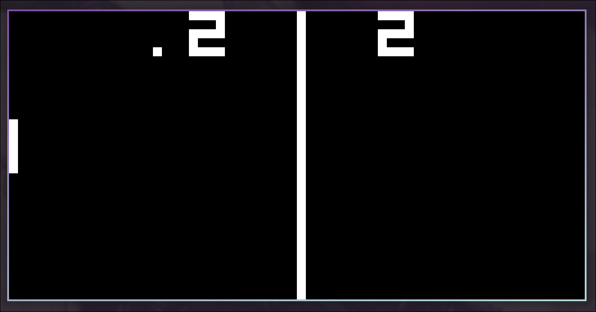
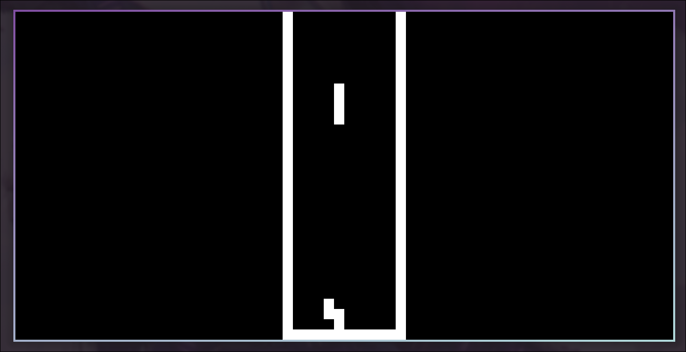
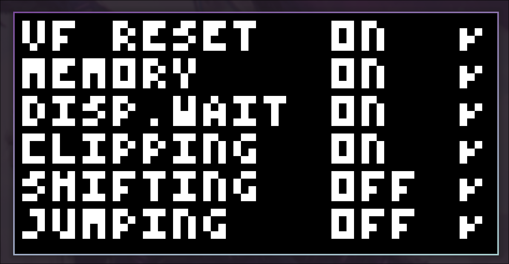

# Chip Eight

My attempt at a Chip-8 emulator, in rust.

CHIP-8 is a simple, interpreted programming language that was developed in the mid-1970s by Joseph Weisbecker to make video game programming more accessible on microcomputers of that era. It's not actually a physical chip but rather a virtual machine designed to run games and simple graphics applications with minimal hardware requirements. More information [here](https://en.wikipedia.org/wiki/CHIP-8).

Features include:
- Full support for all instructions and quirks from the original Chip-8.
- Extensive configuration interface allowing fine-grained control over most aspects of the emulator. See usage section for more details.
- An abstraction layer that sits between the peripheral devices and the core emulator logic. Streamlining the implementation and configuration of alternate engines for the handling of keyboard input, and audio/display output.
- Ready to go SDL3 implementations of input/audio/display peripherals.


## Screenshots






## Setup

Disclaimer: I work entirely on Linux, and have not tested this project on other operating systems. The following steps assume you are also on Linux, and as such, your success may vary.

### Prerequisites

This project requires SDL3. The `sdl3` crate (rust bindings for SDL3) exposes a number of configurable options to resolve this dependency, all of which are accessible via the corresponding `features` flags in `Cargo.toml`. I have it configured to build from source for personal convenience.

_For more details, please refer to the `sdl3` crate [documentation](https://github.com/maia-s/sdl3-sys-rs/tree/main/sdl3-sys#usage)._

### Installation

1. Clone the repo
    ```sh
    git clone https://github.com/brynmailer/chip-eight.git
    cd chip-eight
    ```
2. Build and install
    ```sh
    cargo install --path .
    ```
2. Run the emulator
    ```sh
    chip-eight roms/tests/CHIP8
    ```


## Usage

```sh
chip-eight [OPTIONS] <ROM_PATH>
```

_Pass the `--help` flag for the full list of options._


## Retrospective

Wow... It took me a LOT longer to get around to writing than I anticipated! The original goal here was to get my hands dirty with Rust and, as a result, I didn't think to hard about the boundaries of the project. And instead remained mostly focused on the language itself. This resulted in the inevitable self-imposed scope creep that seems to plague all my self-guided projects that don't have a hard deadline. Somewhere along the way between achieving feature parity with the original Chip 8 computer, and extending the emulator to support the newer extensions, I got distracted by the behemoth of a concept that is Rust's procedural macro system. At the time, I thought it would be cool to write a macro that simplifies the process of implementing support for new instructions. Had the plan come to fruition, such a macro would have been super useful when implementing support for the extensions (both of which add new instructions). Alas, I just can't seem to generate the motivation to execute on this plan. It seems a little silly in hindsight, how hard I got nerd sniped by proc macros and the extreme level of scope creep it led to in what should have been no more that a weekend task. Let this be a lesson on clearly defining project specs I guess ¯\_(ツ)_/¯
